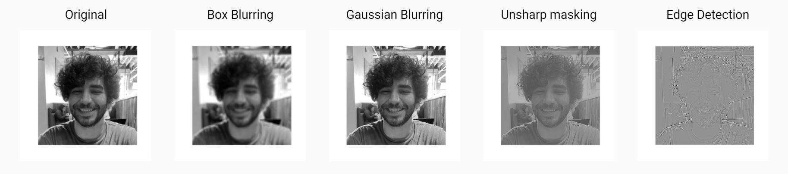

# Convolutions

This project experiements by runing a 2D convolution in a variety of ways. 

The current available implementations here are:
- Serial
- OpenACC
- OpenMP
- Threading 

Each of these implementations and their makefiles can be found in their respective folders

## Sample Convolutions
