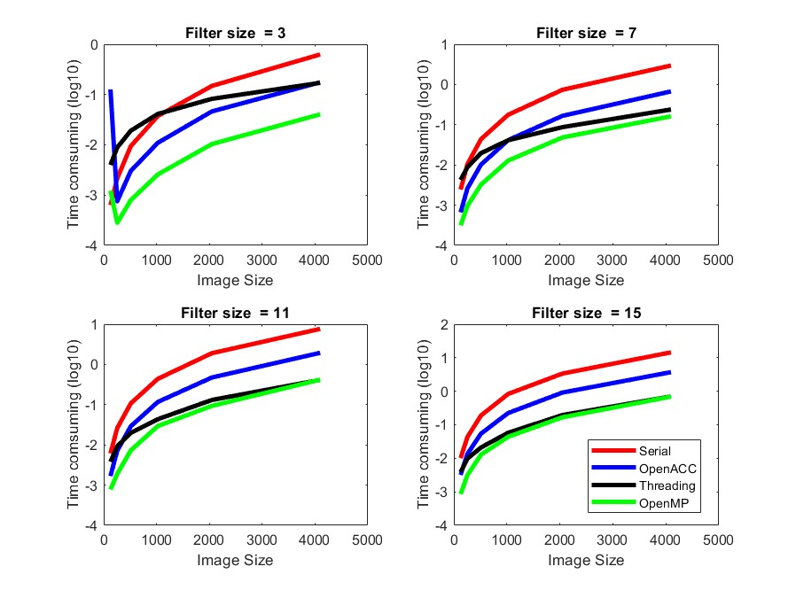
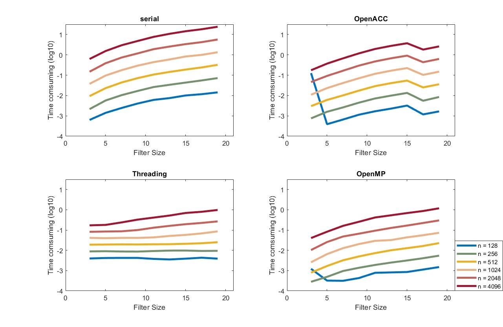

# Convolutions

This project experiments with running a 2D convolution in a variety of ways. 

The current available implementations here are:
- Serial
- OpenACC
- OpenMP
- Threading 

Each of these implementations and their makefiles can be found in their respective folders

## Sample Convolutions

## Performance Comparisons 

The following 2 plots tried to benchmark the performance of each of the implementations are show how the trends change with changes in image size and filter size. 
As either of these parameters increases, the time complexity increases, this makes sense since the convolution will be required to do a larger computation at each step.

Next, it is clear that in any of the parallelized approaches, the time taken by the convolution decreases. This is logical since multiple convolutions are happening simultaneously. 
The best performance was acheived by OpenMP, with threading comming in at a very close second.

